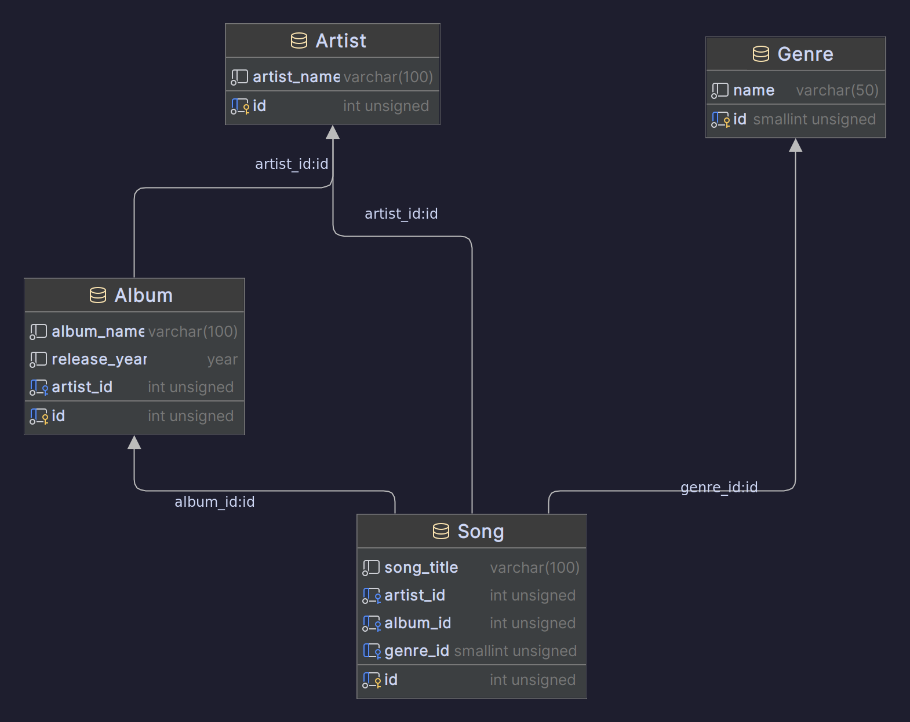

# Music Library Database
## Group Members
- Benjamin Serrano - @benjy1232 - N543Y954
- Austin Jacobs - @AustinBS - J522C262

## Database Schema


## List of Commits
### Benjamin Serrano
```
commit e81c7962c13ac7f42c139b7bc0ce5a4b65bef38e
Author: Ben Serrano <b.serrano8970@gmail.com>
Date:   Fri Apr 12 10:48:12 2024 -0500

    Finish Adding Update/Add/Delete for Songs on the main page

commit 95fb85754d5ea5cebe97d9e83a8aef450e4577b3
Author: Ben Serrano <b.serrano8970@gmail.com>
Date:   Fri Apr 12 23:39:59 2024 -0500

    Remove HomeController and Add Library Controller statements

commit 434409664cbac83c9446ef4c316517a5f6251f93
Author: Ben Serrano <b.serrano8970@gmail.com>
Date:   Thu Apr 11 22:03:27 2024 -0500

    Add Working Artists Page
    
    From the artist page we are now able to add a new artist, update an
    existing artist, or delete an artist.

commit 8bfb010d61c527d36f02b4a84b0f46f0cf82a9a3
Author: Ben Serrano <b.serrano8970@gmail.com>
Date:   Thu Apr 11 20:07:55 2024 -0500

    Add WHERE to SELECT query for Library
    
    Added the ability to use WHERE in SELECT statements when on
    /Library/Index/{artistName}
    
    Fixed Prepared SQL statements that would have caused issues

commit 1974c59146649c3a1c8ade0b16697106ad927141
Author: Ben Serrano <b.serrano8970@gmail.com>
Date:   Thu Apr 11 18:33:52 2024 -0500

    Controllers and Tables
    
    Added first working table in Library/Index.cshtml that is a join of the
    Song, Artist, Album, and Genre Table showing the list of songs we
    currently have. Made some changes to create.sql to allow for unique
    pairings that will prevent duplicates from ending up in the database.
    
    Started working on Controllers and specifically the basic CRUD
    operations within each table.
    
    TODO: Determine if the models that were initially created will still
    be needed. Determine the best way to make a UI to add things to tables

commit bcefb9ea37eb29e0170fc1adca07c3ab6c2bd50f
Author: Ben Serrano <b.serrano8970@gmail.com>
Date:   Thu Apr 11 17:23:09 2024 -0500

    Get working SELECT and JOIN to show on localhost:5036/Library

commit 74af4c4c47de39108819a0ad2c26cd3864d2488d
Author: Ben Serrano <b.serrano8970@gmail.com>
Date:   Wed Apr 10 11:32:17 2024 -0500

    Update create.sql to allow deletion and cascading to other tables

commit 21fa68d0bbefce6ef077d91948bc84b98be625e8
Author: Ben Serrano <b.serrano8970@gmail.com>
Date:   Wed Apr 10 11:29:25 2024 -0500

    Add .gitignore to ignore Rider files

commit c7480d8aed273e2ecab6a6df1a88d1f59cdc65ff
Author: Ben Serrano <b.serrano8970@gmail.com>
Date:   Wed Apr 10 11:28:12 2024 -0500

    Add basic models and example SQL query in Program.cs

commit 03fe772d54cf5ce6ff8c0c97361f58a516ddb148
Author: Ben Serrano <b.serrano8970@gmail.com>
Date:   Wed Apr 10 10:32:17 2024 -0500

    Fix SQL Issues

commit 1674c0a03041ac4378eed80e2d91c70b1b223f69
Author: Ben Serrano <b.serrano8970@gmail.com>
Date:   Wed Apr 10 09:40:50 2024 -0500

    Remove User Things

commit 5e09d63f64dccd7dc7a00601b750a6b78d40ebc8
Author: Ben Serrano <b.serrano8970@gmail.com>
Date:   Wed Apr 10 09:03:42 2024 -0500

    Update table to meet 4 tables requirement

commit af899dd9567f669b821d48fc9c4731efe8b8f9db
Author: Ben Serrano <b.serrano8970@gmail.com>
Date:   Tue Apr 9 22:54:59 2024 -0500

    Base environment setup
    
    Add support for MySQL in a Docker container as well as all the strings
    that are needed in order to properly run things.

commit 2b6eed8d9d4c708858ac9557f3d79a5061467ff1
Author: Ben Serrano <b.serrano8970@gmail.com>
Date:   Tue Apr 9 21:36:08 2024 -0500

    Initial Commit
```

### Austin Jacobs
```
commit 2d2064e98b9b3c2e9dc98b78f040e94b30b2ee7d
Merge: 4c7d45e 75bdb5b
Author: Austin <AustinJames1603@gmail.com>
Date:   Mon Apr 15 19:40:52 2024 -0500

    Merge branch 'austin_album_controller'

commit 75bdb5b140672231de46a34cf1867f5fcc2280f4
Author: Austin <AustinJames1603@gmail.com>
Date:   Mon Apr 15 17:16:12 2024 -0500

    Fixed artist_name dropdown functionality

commit 98c759dc939604289858d34d4a1e59d7cb814ed7
Author: Austin <AustinJames1603@gmail.com>
Date:   Sun Apr 14 20:57:38 2024 -0500

    Added HTML for Album Controller

commit 309330e7834d62c5ce66a7d289f6293ec5cb8cf8
Author: Austin <AustinJames1603@gmail.com>
Date:   Sun Apr 14 15:29:30 2024 -0500

    Added Album Controller

commit 4c7d45e5842e90af85795702d01a5429aae94984
Merge: e81c796 f8d0ec6
Author: Austin <AustinJames1603@gmail.com>
Date:   Sat Apr 13 23:23:57 2024 -0500

    Merge branch 'austin_genreController'

commit f8d0ec657e61c6d53231764d9ce011cb25f60f75
Author: Austin <AustinJames1603@gmail.com>
Date:   Sat Apr 13 23:09:26 2024 -0500

    Updated SQL create statements and added html for Genre

commit 16dc8e2862f27cdda046516c316d2fb6c45d5698
Author: Austin <AustinJames1603@gmail.com>
Date:   Sat Apr 13 18:52:41 2024 -0500

    Added Genre Controller
```

## Demo Video
[Demo Video](https://youtu.be/7PzAzASVVYc)
